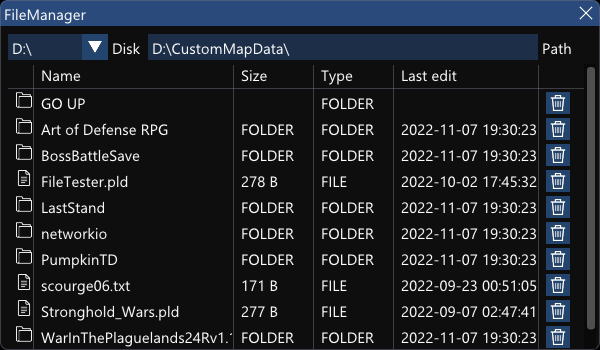

# Imgui file manager
 Simple file manager created with C++ and ImGui. Can be used for creating file dialogs and etc

Requires DirectX SDK To build https://www.microsoft.com/en-us/download/details.aspx?id=6812
Windows

ToDo:
1.Fix columns
2.Add sorting

